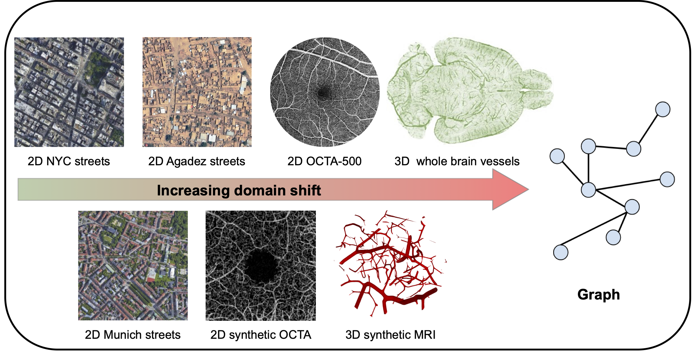

In this Master thesis we aim to approach the cross-domain transfer learning problem with two powerful methods that help us to bridge the domain gap between source and target domain: contrastive learning [1] and generative models. Specifically, we want to solve the transfer learning problem for the computer vision task of graph extraction from images (e.g. road network extraction, blood-vessel network extraction, scene graph generation, or pose estimation) [2].

To address these challenges, we propose two innovative strategies where one or ideally both can be explored during the course of the thesis:

1. Contrastive Learning for Domain Alignment [1]: Leveraging the power of contrastive learning, we seek to achieve domain alignment while harnessing label information from both domains.

2. Image-to-Image Translation with Generative Models: By exploring the capabilities of diffusion models [3] or GANs [4], we aim to generate target domain samples from source domain data.

Both of these approaches will be applied to the Relationformer architecture, a unified one-stage transformer-based framework introduced in our recent ECCV paper [2]. Our experimentation will involve working with extensive biological datasets, such as whole brain vasculature [5], neurons, and satellite imagery.
 

 

## Your qualifications:

We are looking for a highly motivated Master’s student in Computer Science, Physics, Engineering or Mathematics. Your goal is to extend the existing Pytorch codebase and apply it to novel datasets. You will be working together with Johannes and Alex, two PostDocs scientist at TU Munich and Imperial College London under the supervision of Prof. Daniel Rückert. Importantly, we aim to publish the results of this work, with you, in a follow up study at a high-impact machine learning conference or in an academic journal.

1. Strong motivation and interest in machine learning.
2. Advanced programming skills in C++, Python or C.
3. Strong interest in teamwork and interdisciplinary research.

 

## What we offer:

-   An exciting research project with many possibilities to bring in your own ideas.
-   Close supervision and access to state-of-the-art computer hardware.
-   The chance to work in a team of highly qualified experts in machine learning, computer vision, and deep learning.

 

## How to apply:

Just send an email to j.paetzold@ic.ac.uk and a.berger@tum.de, with a short CV and your grade report. We promise to get back to you within days.

 

 

## References:

[1] Motiian, Saeid, et al. "Few-shot adversarial domain adaptation." Advances in neural information processing systems 30 (2017).

[2] Shit, Suprosanna, et al. "Relationformer: A unified framework for image-to-graph generation." European Conference on Computer Vision. Cham: Springer Nature Switzerland, 2022.

[3] Saharia, Chitwan, et al. "Palette: Image-to-image diffusion models." ACM SIGGRAPH 2022 Conference Proceedings. 2022.

[4] Liu, Ming-Yu, Thomas Breuel, and Jan Kautz. "Unsupervised image-to-image translation networks." Advances in neural information processing systems 30 (2017).

[5] Paetzold, Johannes C., et al. "Whole Brain Vessel Graphs: A Dataset and Benchmark for Graph Learning and Neuroscience." Thirty-fifth Conference on Neural Information Processing Systems Datasets and Benchmarks Track (Round 2). 2021.
 
