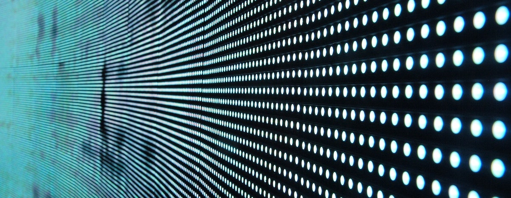

Anomaly detection aims to identify patterns that do not conform to the expected normal distribution.
Despite its importance for clinical applications, the detection of outliers is still a very challenging task due to the
rarity, unknownness, diversity and heterogeneity of abnormalities.
Basic problem formulations to recent advances in the field will be discussed.
This includes, but is not limited to: reconstruction-based
auto-encoders (AE) adversarial methods, diffusion models, and others.
In short this course offers students to:
 - Learn how to critically read and understand scientific papers
 - Get hands-on practice in implementing anomaly detection methods on medical data
 - Practice the presentation and discussion of experimental results
 - Get a multi-facetted view in multiple guest lecturers by reknown researchers in the field of anomaly detection
## Prerequisites:
 - Understanding of Deep Learning and Neural Networks, demonstrated through the completion of at least one learning or deep learning course (e.g. Intro to Deep Learning, Advanced Deep Learning, Machine Learning, or equivalent).
 - Good coding skills in Python
 - Coding experience in PyTorch
 - Interest in medical imaging

 ## Methods:
 - Students will select a relevant paper and present it critically
 - They will then implement the method in the paper given our framework and data
 - Experimental results will be presented to the lecturers and fellow students in a poster session

<!-- ## Preliminary meeting
A preliminary meeting will take place on 31st of January, 2023 at 11:30 on zoom with the following details: https://tum-conf.zoom.us/j/69075883519 

Meeting ID: 690 7588 3519 \
Passcode: 850155  -->
