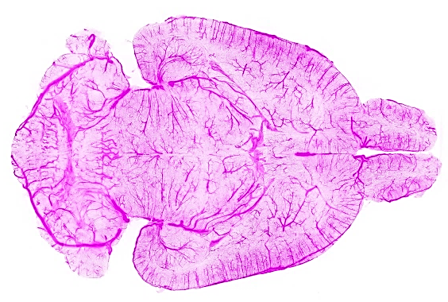

In this Master thesis we aim to address the graph extraction problem using a new powerful class of neural networks - Diffusion [2]. A comprehensive representation of an image requires understanding objects and their mutual relationship, especially in image-to-graph generation, e.g., road network extraction, blood-vessel network extraction, or scene graph generation. 
Traditionally, image-to-graph generation is addressed with a two-stage approach consisting of object detection followed by a separate relation prediction, which prevents simultaneous object-relation interaction. In our recent ECCV paper, we proposed a unified one-stage transformer-based framework, namely *Relationformer* that jointly predicts objects and their relations [1]. 

Our applications will be large scale biological applications for example the whole brain vasculature [3] or neurons as well as satellite imagery. 

 

 

## Your qualifications:

We are looking for a highly motivated Master’s student in Computer Science, Physics, Engineering or Mathematics. Your goal is to extend the existing Pytorch codebase and apply it to novel datasets. You will be working together with Suprosanna and Johannes, two PostDocs scientist at TU Munich and Imperial College London under the supervision of Prof. Daniel Rückert. Importantly, we aim to publish the results of this work, with you, in a follow up study at a high-impact machine learning conference or in an academic journal. 

1. Strong motivation and interest in machine learning. 
2. Advanced programming skills in C++, Python or C.  
3. Strong interest in teamwork and interdisciplinary research. 

 

## What we offer:

- An exciting research project with many possibilities to bring in your own ideas.
- Close supervision and access to state-of-the-art computer hardware.
- The chance to work in a team of highly qualified experts in machine learning, computer vision and deep learning.

 

## How to apply:

Just send an email to suprosanna.shit@tum.de and j.paetzold@ic.ac.uk, with a short CV and your grade report. We promise to get back to you within days. 

 

 

## References:

[1] Shit, Suprosanna, et al. "Relationformer: A Unified Framework for Image-to-Graph Generation.", https://arxiv.org/abs/2203.10202

[2] Chen et al. "DiffusionDet: Diffusion Model for Object Detection.", https://arxiv.org/pdf/2211.09788.pdf

[3] Paetzold, Johannes C., et al. "Whole Brain Vessel Graphs: A Dataset and Benchmark for Graph Learning and Neuroscience." Thirty-fifth Conference on Neural Information Processing Systems Datasets and Benchmarks Track (Round 2). 2021.
 