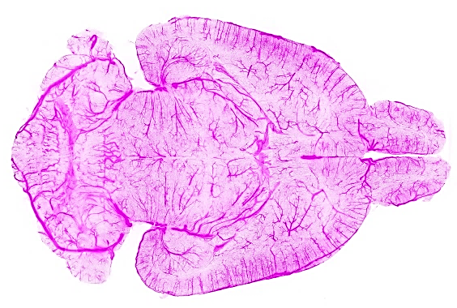

Detecting aneurysm in 3D volumetric TOF MRA is difficult because a) the variation in shape information of aneurysms is hard to capture in patch-based 3D approach using just intensity information b) processing full 3D volumetric image is computationally demanding. In this Master thesis we aim to address this with shape analysis of blood vessels. Vessel surface lies in a non-Euclidean manifold which can be described by its i) vertices i.e. point-cloud ii) mesh i.e. vertices, edges and faces.  Thus we reformulate aneurysm detection as into two sub tasks on segmented vessel: i) aneurysm recognition: classification of vessel mesh ii) aneurysm segmentation: part segmentation of vessel surface.  We aim to translate recent progress of the transformer based model [1,2] for this geometric deep learning task on multiple vessel mesh  datasets [3,4].

 

 

## Your qualifications:

We are looking for a highly motivated Master's student in Computer Science, Physics, Engineering or Mathematics. Your goal is to apply recent transformer-based part segmentation to three vessel mesh datasets. You will be working together with Suprosanna and Johannes, two senior computater scientist at TU Munich and Imperial College London under the supervision of Prof. Daniel Rückert. Importantly, we aim to publish the results of this work, with you, in a follow up study at a high-impact machine learning conference or in an academic journal.
1. Strong motivation and interest in machine learning.
2. Advanced programming skills in C++, Python or C. 
3. Strong interest in teamwork and interdisciplinary research.

 

## What we offer:

- An exciting research project with many possibilities to bring in your own ideas.
- Close supervision and access to state-of-the-art computer hardware.
- The chance to work in a team of highly qualified experts in machine learning, computer vision and deep learning.

 

## How to apply:

Just send an email to suprosanna.shit@tum.de and j.paetzold@ic.ac.uk, with a short CV and your grade report. We promise to get back to you within days.

 

## References:

[1] He, Chenhang, et al. "Voxel Set Transformer: A Set-to-Set Approach to 3D Object Detection from Point Clouds." Proceedings of the IEEE/CVF Conference on Computer Vision and Pattern Recognition. 2022.
[2] Lai, Xin, et al. "Stratified Transformer for 3D Point Cloud Segmentation." Proceedings of the IEEE/CVF Conference on Computer Vision and Pattern Recognition. 2022.
[3] Pozo Soler, Jose; Frangi, Alejandro F; Consortium, The @neurIST (2017): Database of Cerebral Artery Geometries including Aneurysms at the Middle Cerebral Artery Bifurcation. The University of Sheffield. Dataset. https://doi.org/10.15131/shef.data.4806910.v1.
[4] Yang, Xi, et al. "Intra: 3d intracranial aneurysm dataset for deep learning." Proceedings of the IEEE/CVF Conference on Computer Vision and Pattern Recognition. 2020.

 